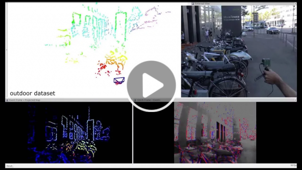
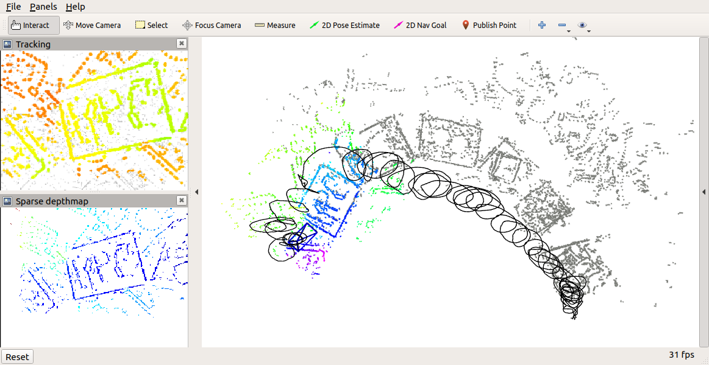

# EVO: Event based Visual Odometry

[](https://www.youtube.com/watch?v=bYqD2qZJlxE)

<a name="license"></a>
## Credit, License, and Patent
### Citation
This code implements the event-based visual odometry pipeline described in the paper [EVO: A Geometric Approach to Event-Based 6-DOF Parallel Tracking and Mapping in Real-time](http://rpg.ifi.uzh.ch/docs/RAL16_EVO.pdf) by [Henri Rebecq](https://supitalp.github.io/research/), Timo Horstschaefer, [Guillermo Gallego](https://sites.google.com/view/guillermogallego) and [Davide Scaramuzza](http://rpg.ifi.uzh.ch/people_scaramuzza.html).

If you use any of this code, please cite the following publications:

```bibtex
@Article{RebecqEVO,
  author        = {Rebecq, Henri and Horstschaefer, Timo and Gallego, Guillermo and Scaramuzza, Davide},
  journal       = {IEEE Robotics and Automation Letters}, 
  title         = {EVO: A Geometric Approach to Event-Based 6-DOF Parallel Tracking and Mapping in Real Time}, 
  year          = {2017},
  volume        = {2},
  number        = {2},
  pages         = {593-600},
  doi           = {10.1109/LRA.2016.2645143}
}
```

```bibtex
@InProceedings{Gehrig_2020_CVPR,
  author = {Daniel Gehrig and Mathias Gehrig and Javier Hidalgo-Carri\'o and Davide Scaramuzza},
  title = {Video to Events: Recycling Video Datasets for Event Cameras},
  booktitle = {{IEEE} Conf. Comput. Vis. Pattern Recog. (CVPR)},
  month = {June},
  year = {2020}
}
```

If you don't have an event camera, you can do one of the following:
* Using one of our event camera datasets:
  * http://rpg.ifi.uzh.ch/davis_data.html
  * https://dsec.ifi.uzh.ch/
  * https://fpv.ifi.uzh.ch/
  * http://rpg.ifi.uzh.ch/E2VID.html
  * http://rpg.ifi.uzh.ch/CED.html
  * http://rpg.ifi.uzh.ch/direct_event_camera_tracking/index.html
  * http://rpg.ifi.uzh.ch/ECCV18_stereo_davis.html
* Generate one using event-camera simulator: http://rpg.ifi.uzh.ch/esim/index.html
* Convert a standard video to events using our "Video to Events: Recycling Video Datasets for Event Cameras." cited above, code here: https://github.com/uzh-rpg/rpg_vid2e
### Patent & License

- The proposed EVO method is [patented](https://patentscope.wipo.int/search/en/detail.jsf?docId=WO2018037079).

        H. Rebecq, G. Gallego, D. Scaramuzza
        Simultaneous Localization and Mapping with an Event Camera
        Pub. No.: WO/2018/037079.  International Application No.: PCT/EP2017/071331
    
- The license is [available here](LICENSE).

### Acknowledgements
The open sourcing was curated by [Antonio Terpin](https://antonioterpin.github.io) and [Daniel Gehrig](https://danielgehrig18.github.io).

#### Table of contents
1. [Getting started](#getstarted)
2. [Examples](#examples)
3. [Running live](#live)
4. [Further improvements](#todo)
5. [Additional resources on Event Cameras](#ref)

Remark that this is **research** code, any fitness for a particular purpose is disclaimed.

<a name="getstarted"></a>
## Getting started
This software depends on [ROS](https://www.ros.org/). Installation instructions can be found [here](http://wiki.ros.org/melodic/Installation/Ubuntu). We have tested this software on Ubuntu 18.04 and ROS Melodic.

1. Create and initialize a new catkin workspace if needed

        mkdir -p ~/catkin_ws/src && cd ~/catkin_ws/
        catkin config \
            --init --mkdirs --extend /opt/ros/melodic \
            --merge-devel --cmake-args \
            -DCMAKE_BUILD_TYPE=Release

2. Clone this repository

        cd src/ && git clone git@github.com:uzh-rpg/rpg_dvs_evo_open.git

3. Clone (and fix) dependencies
        
        ./rpg_dvs_evo_open/install.sh [ros-version] # [ros-version]: melodic, ..

    Substitute `[ros-version]` with your actual ROS distribution. For instance:

        ./rpg_dvs_evo_open/install.sh melodic

    Make sure to install ROS and the commonly used packages (such as rviz, rqt, ..).

    The above commands do the following:
    * First, we install the required packages.

    * Second, we clone the [repositories](dependencies.yaml) evo relies on.

    Remark that with the above commands we install also the dependencies required to run the pipeline live. If you do not need them, you can comment the unnecessary packages from the dependencies.yaml file ([davis driver](https://github.com/uzh-rpg/rpg_dvs_ros)).

    Please refer to [this repo](https://github.com/uzh-rpg/rpg_dvs_ros) if there are issues with the driver installation (required for the live).

4. Build the packages
    
        catkin build dvs_tracking

Building everything might take some time... this might be the right time for a coffee! :)
    
... and do not forget to source the workspace afterwards!

    source ../devel/setup.bash

<a name="examples"></a>
## Examples



| Example | Launch file | Rosbag |
|:----- |:----- |:-----|
| Multi-keyframe sequence | [flyingroom.launch](dvs_tracking/launch/flyingroom.launch) | [538 MB](http://rpg.ifi.uzh.ch/data/EVO/code_examples/evo_flyingroom.bag)|
| Desk sequence | [desk.launch](dvs_tracking/launch/desk.launch) | [145 MB](http://rpg.ifi.uzh.ch/data/EVO/code_examples/evo_desk.bag)|

To download the rosbags, you can use the following command:

    wget [rosbag link] -O /path/to/download/folder/

For instance, the following will download the multi-keyframe sequence rosbag:

    wget http://rpg.ifi.uzh.ch/data/EVO/code_examples/evo_flyingroom.bag -O /tmp/evo_flyingroom.bag

To run the pipeline from a rosbag, first start the pipeline as

    roslaunch dvs_tracking [launch-file] auto_trigger:=true

where the specific launch file (fine-tuned) for each example is listed in the following table. The most interesting and repeatible one (due to the bootstrapping sequence, see [further improvements](#todo)) is the multi-keyframe sequence.

Then, once the everything is loaded, run the rosbag as

    rosbag play -r 0.7 [rosbag-file]

For instance,

    rosbag play -r 0.7 /tmp/evo_flyingroom.bag

Remark that we set the ```auto_trigger``` parameter to true. You can also set it to false and follow the instruction on [how to run it live](#live).

If anything fails, just try it again (give it a couple of chances!), and make sure to follow exactly the above instructions.

In the [further improvements](#todo) section are outlined the things that might go wrong when running the code. To improve the reliability when playing the rosbags (running live is easier), consider using ```-r .7```, to reduce the rate. This helps especially when the hardware is not powerful enough.

For instance,

    rosbag play /tmp/evo_flyingroom -r .7

Eventually, setting ```bootstrap_image_topic:=/dvs/image_raw``` will bootstrap from traditional frames and later switch to only events. This is the most reliable way currently available to bootstrap. 

    roslaunch dvs_tracking [launch-file] bootstrap_image_topic:=/dvs/image_raw auto_trigger:=true

<a name="live"></a>
## Running live

### Run
The procedure is analogous to the one explained in the examples:

1. Run the ros core on the first terminal.

        roscore

2. On a second terminal, launch the event camera driver.

        rosrun davis_ros_driver davis_ros_driver

3. On another terminal, launch the pipeline, disabling the auto-triggering.

        roslaunch dvs_tracking live.launch auto_trigger:=false camera_name:=[calibration filename] events_topic:=[events topic]

    For instance:

        roslaunch dvs_tracking live.launch auto_trigger:=false camera_name:=DAVIS-ijrr events_topic:=/dvs/events

    If your calibrations filenames are `my_camera.yaml`, then use `camera_name:=my_camera`. Make sure to use the same name for both calibration files. If your sensor outputs events under the topic `/my_sensor/events`, then use `events_topic:=/my_sensor/events`.

    For the SVO based bootstrapper, proceed with step 4. For the fronto-planar bootstrapper, go to step 5. How to set up the fronto-planar bootstrapper is explained in the [live.launch](dvs_tracking/launch/live.launch) file.

    If you want to bootstrap from traditional frames, you can use the command:

        roslaunch dvs_tracking live.launch bootstrap_image_topic:=[topic raw frames] auto_trigger:=false

    For instance `bootstrap_image_topic:=/dvs/image_raw`.

    In this case, it makes sense to use the SVO-based bootstrapping only. This option is recommended to debug/improve/extend the rest of the EVO pipeline, without worrying about the quality of the bootstrapping.

4. You should see two rqt GUI. One is the SVO GUI. Reset and start the pipeline until it tracks decently well. Make sure to set the namespace to `svo`.

5. Press the `Bootstrap` button in the EVO GUI. This will automatically trigger the pipeline.

    Alternatively, it is also possible to trigger one module at the time:
    - Press the `Start/Reset` button in `rqt_evo`. Perform a circle (or more), and then press `Update`. This will trigger a map creation.
    - If the map looks correct, press `Switch to tracking` to start tracking with EVO. If not, reiterate the map creation.
    - As the camera moves out of the current map, the latter will be automatically updated if the `Map-Expansion` is enabled. You may disable `Map-Expansion` to track high-speed motions using the current map (single keyframe tracking).
    - The scene should have enough texture and the motions should recall the ones that you can see in the provided examples.
    
6. If anything fails, just press ```Ctrl+C``` and restart the live node ;)

Some remarks:
- The calibration files paths will be built as `$(find dvs_tracking)/parameters/calib/ncamera/$(arg camera_name).yaml` and `$(find dvs_tracking)/parameters/calib/$(arg camera_name).yaml`, where `camera_name` is specified as argument to the launch file. You can also set it as default in `live.launch`.
- If your sensor provides frames under a topic `/my_sensor/image_raw`, and you want to bootstrap from the traditional frames, you can use `bootstrap_image_topic:=/my_sensor/image_raw`.

To run the pipeline live, first adjust the template [live.launch](dvs_tracking/launch/live.launch) to your sensor and scene. You can follow the following steps. Further customization, such as which bootstrapper to use, are explained in the launch file itself.

### Calibration
Make sure you have updated calibration files for your event camera, in the  ```dvs_tracking/parameters/calib``` folder.

Make sure your ```.yaml``` files have the same format as the provided ones ([single camera format](dvs_tracking/parameters/calib/DAVIS-evo.yaml), [multiple cameras format](dvs_tracking/parameters/calib/ncamera/DAVIS-evo.yaml)).

Remark that we have two calibration files in two different format for the same sensor. The single camera format has to be placed in the ```dvs_tracking/parameters/calib``` folder and the multiple cameras format in the ```dvs_tracking/parameters/calib/ncamera``` folder.

See [this section](#ref) for further references on calibration.

### Tuning
Adjust the parameters in the launch file [```dvs_tracking/launch/template.launch```](dvs_tracking/launch/template.launch).

Tuning is crucial for a good performance of the pipeline, in particular the ```min_depth``` and ```max_depth``` parameters in the mapping node, and the ```bootstrap``` node parameters.

An explanation of all the parameters for each module of the pipeline can be found in the [Wiki](https://github.com/uzh-rpg/rpg_dvs_evo_open/wiki).

The main parameters can be found in the template launch file, and are explained contextually. We still invite you to have a look at the Wiki, to discover further interesting features ;)

| Module |
|:-----|
| [Global parameters](https://github.com/uzh-rpg/rpg_dvs_evo_open/wiki/Global-parameters) |
| [Bootstrapping](https://github.com/uzh-rpg/rpg_dvs_evo_open/wiki/Bootstrapping) |
| [Mapping](https://github.com/uzh-rpg/rpg_dvs_evo_open/wiki/Mapping) |
| [Tracking](https://github.com/uzh-rpg/rpg_dvs_evo_open/wiki/Tracking) |

If you are not using the fronto-planar bootstrapper, then you might need to tune SVO.

Remark that this might not be needed. You can test the svo tuning bootstrapping from traditional frames:

    roslaunch dvs_tracking live.launch bootstrap_image_topic:=[topic of raw frames] auto_trigger:=[true/false]

For instance, `bootstrap_image_topic:=/dvs/image_raw`.

<a name="todo"></a>
## Further improvements

In the following we outline the main problems currently known and possible remedies. You are very welcome to contribute to this pipeline to make it even better!

|What can go wrong|TODO|
|:----- |:-----|
|Randomness due to OS scheduler, unreliable rosbags| Implement rosbag data provider pattern, and ensure correctness of events consumption|
||Currently the pipeline uses multiple nodes. Switching to nodelets or using a single node could improve the repeatability of the rosbags.|
|Robustness| bootstrapping: catch whenever SVO does not converge and trigger an automatic restart (what a human operator would eventually do manually).|
|| tracking: catch whenever the tracker diverges, and re-initialize. Currently we have two parameters to predict this situation, namely `min_map_size` and `min_n_keypoints`.|
|Improve bootstrapping robustness|Currently we have two working ways to bootstrap the pipeline from events: from SVO (feeding it with events frames) and with a fronto-planar assumption.|
||Reducing the assumptions required and making them more reliable would allow a better bootstrapping, reducing the gap to the bootstrapping from traditional frames  (`bootstrap_image_topic:=/dvs/image_raw`).|

<a name="ref"></a>
## Additional resources on Event Cameras
* [Event-based Vision Survey](http://rpg.ifi.uzh.ch/docs/EventVisionSurvey.pdf)
* [List of Event-based Vision Resources](https://github.com/uzh-rpg/event-based_vision_resources)
* [Event Camera Dataset](http://rpg.ifi.uzh.ch/davis_data.html)
* [Event Camera Simulator](http://rpg.ifi.uzh.ch/esim)
* [RPG research page on Event Cameras](http://rpg.ifi.uzh.ch/research_dvs.html)
* [RPG research page on sensor calibration](http://rpg.ifi.uzh.ch/research_calib.html)
